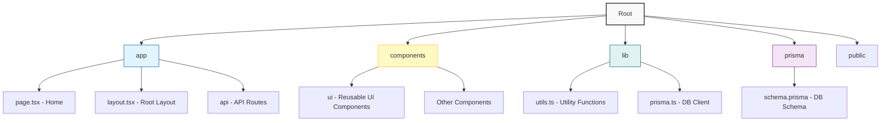

# Bytetools

Welcome to **Bytetools**! A modern web application built with [Next.js](https://nextjs.org), designed to provide essential utilities for developers and regular users alike.

## 🚀 Getting Started

Follow these instructions to get a copy of the project up and running on your local machine for development and testing purposes.

### Prerequisites

Ensure you have the following installed on your machine:

- [Node.js](https://nodejs.org/) (latest LTS version recommended)
- [Bun](https://bun.sh/) (as the package manager and runtime)
- [PostgreSQL](https://www.postgresql.org/) (if running a local DB instance, though this project is configured for NeonDB)

### Installation

1.  **Clone the repository:**

    ```bash
    git clone https://github.com/lwshakib/bytetools.git
    cd bytetools
    ```

2.  **Install dependencies:**

    ```bash
    bun install
    ```

3.  **Environment Setup:**

    Copy the `.env.example` file to `.env` and fill in your credentials.

    ```bash
    cp .env.example .env
    ```

    > **Note:** You will need a Database URL (PostgreSQL) and OAuth credentials for Google Authentication.

4.  **Database Setup:**

    Initialize the database using Prisma.

    ```bash
    # Generate Prisma Client
    bun run db:generate

    # Run migrations
    bun run db:migrate
    ```

### Running the Application

Start the development server:

```bash
bun dev
```

Open [http://localhost:3000](http://localhost:3000) with your browser to see the result.

## 🛠️ Tech Stack

- **Framework:** [Next.js 16](https://nextjs.org/)
- **Language:** [TypeScript](https://www.typescriptlang.org/)
- **Database:** [PostgreSQL](https://www.postgresql.org/) (via [Neon](https://neon.tech/))
- **ORM:** [Prisma](https://www.prisma.io/)
- **Styling:** [Tailwind CSS](https://tailwindcss.com/)
- **Components:** [shadcn/ui](https://ui.shadcn.com/)
- **Authentication:** [Better Auth](https://better-auth.com/)
- **Package Manager:** [Bun](https://bun.sh/)

## 📊 Project Structure

Here is a high-level overview of the project structure using Mermaid:



## 🤝 Contributing

We welcome contributions! Please see our [CONTRIBUTING.md](CONTRIBUTING.md) for details on how to get started.

Please adhere to this project's [Code of Conduct](CODE_OF_CONDUCT.md).

## 📄 License

This project is open-source. Please see the [LICENSE](LICENSE) file for details.

## 👤 Author

**lwshakib**

- GitHub: [@lwshakib](https://github.com/lwshakib)

---
*Built with ❤️ by the open-source community.*
