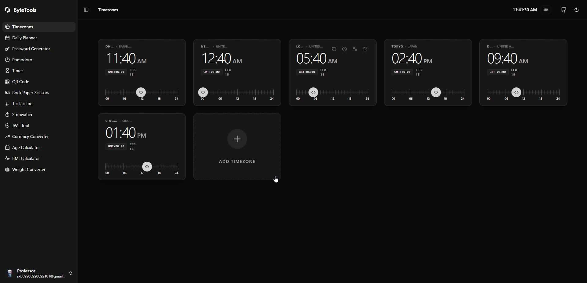
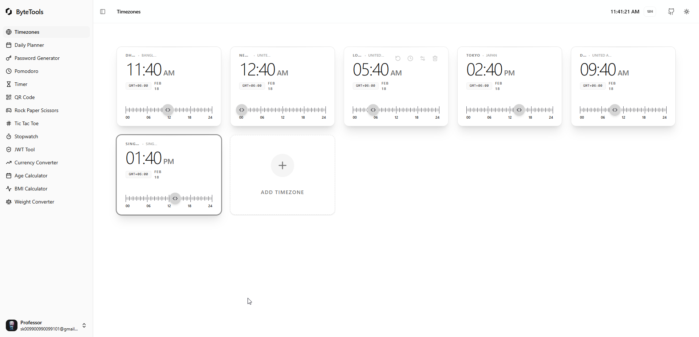
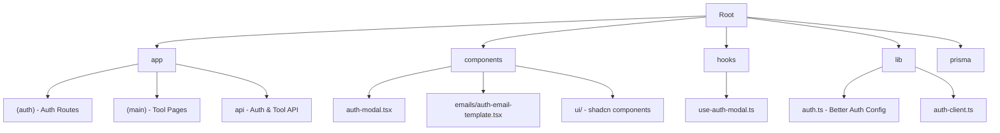

#  Bytetools

Welcome to **Bytetools**! A modern, premium utility suite built with [Next.js](https://nextjs.org), designed to provide essential, privacy-focused tools for developers and power users.




## ✨ Key Features

- **Authentication Suite**: Highly secure login and sign-up with mandatory email verification and password reset flows using [Better Auth](https://better-auth.com/).
- **Global Auth Modal**: Seamless access to your account from any tool through a central, global state-managed modal.
- **Privacy First**: All calculations and data transformations happen locally in your browser.
- **Responsive Design**: Fluid, high-fidelity UI built with Tailwind CSS and Framer Motion.
- **Toolbox**:
  - 🌍 **Timezones**: Global temporal mapping and conversion.
  - 📅 **Daily Planner**: Simple, effective task management.
  - 🔑 **Password Gen**: Secure cryptographic generation.
  - ⏱️ **Pomodoro & Timer**: Focus enhancement utilities.
  - 📱 **QR Hub**: Matrix code generation and sharing.
  - 🛠️ **JWT & Developer Tools**: Debugging and technical utilities.
  - ⚖️ **Calculators**: BMI, Age, Currency, and Unit Converters.

## 🚀 Getting Started

### Prerequisites

- [Node.js](https://nodejs.org/) (latest LTS)
- [Bun](https://bun.sh/)
- [PostgreSQL](https://www.postgresql.org/) (Local or via NeonDB)

### Installation

1.  **Clone the repository:**

    ```bash
    git clone https://github.com/lwshakib/bytetools.git
    cd bytetools
    ```

2.  **Install dependencies:**

    ```bash
    bun install
    ```

3.  **Environment Setup:**
    Copy `.env.example` to `.env` and fill in your credentials (Database, Google OAuth, Resend API).

4.  **Database Migration:**
    ```bash
    bun run db:migrate
    ```

### Running Locally

```bash
bun dev
```

## 🛠️ Tech Stack

- **Framework**: [Next.js 16](https://nextjs.org/)
- **Styling**: [Tailwind CSS 4](https://tailwindcss.com/), [shadcn/ui](https://ui.shadcn.com/)
- **Animations**: [Framer Motion](https://www.framer.com/motion/)
- **Auth**: [Better Auth](https://better-auth.com/)
- **Database**: [Prisma ORM](https://www.prisma.io/) with PostgreSQL
- **Email**: [Resend](https://resend.com/) & [React Email](https://react.email/)
- **State Management**: [Zustand](https://zustand-demo.pmnd.rs/)

## 📊 Project Structure


```mermaid
graph TD
    Root[Root] --> App[app]
    Root --> Components[components]
    Root --> Hooks[hooks]
    Root --> Lib[lib]
    Root --> Prisma[prisma]

    App --> Auth["(auth) - Auth Routes"]
    App --> Main["(main) - Tool Pages"]
    App --> API["api - Auth & Tool API"]

    Components --> AuthComp[auth-modal.tsx]
    Components --> EmailComp[emails/auth-email-template.tsx]
    Components --> UI[ui/ - shadcn components]

    Hooks --> AuthHook[use-auth-modal.ts]

    Lib --> AuthLib[auth.ts - Better Auth Config]
    Lib --> ClientLib[auth-client.ts]
```

## 🤝 Contributing

We welcome contributions! Please see our [CONTRIBUTING.md](CONTRIBUTING.md) and [Code of Conduct](CODE_OF_CONDUCT.md).

## 📄 License

This project is licensed under the MIT License - see the [LICENSE](LICENSE) file for details.

---

_Built with ❤️ by [lwshakib](https://github.com/lwshakib)_
